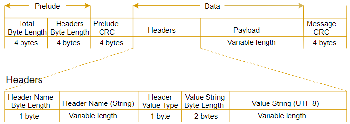

.. _amazon-eventstream:

=================================
Amazon Event Stream Specification
=================================

This specification describes the ``application/vnd.amazon.eventstream``
:ref:`event stream <event-streams>` encoding, a generic data encoding designed
to support bidirectional datagram-oriented communication on top of an existing,
reliable, stream-oriented protocol. This is the encoding used by AWS services,
regardless of protocol.

The encoding provides several capabilities:

* Message framing and delineation, so that discrete datagrams can be transmitted
  over a stream-oriented protocol.
* Comprehensive integrity checks, ensuring that corruption can always be
  recognized and handled immediately.
* Extensible message metadata.
* Efficient binary framing and encoding.

The encoding does NOT provide the following capabilities, though it could be
extended to support them:

* Message fragmentation, or streaming a single payload as multiple messages.
* Relaying events over an unordered, unreliable transport such as UDP.

The :rfc:`media type <6838>` for this format is
``application/vnd.amazon.eventstream``.

.. _amazon-eventstream-wire-format:

-----------
Wire Format
-----------

The wire format is structured as a sequence of binary messages. This
specification adopts the presentation language of
:rfc:`RFC 5246 section 4 <5246#section-4>` to describe the format of these
messages. This language is a type of psuedocode similar to C used to define
serialized binary representations of messages. Note that all integer types are
in network byte order, or big-endian.

.. _amazon-eventstream-message-format:

Message Format
==============

The wire format is structured as a sequence of messages. Messages consist of two
sections: the prelude and the data. The prelude section contains a four-byte
unsigned integer representing the total length of the message and a four-byte
unsigned integer representing the total length of the message's headers. The
data section consists of the :ref:`headers <amazon-eventstream-headers-format>`
followed by a payload.

Both sections end with a four-byte unsigned integer representing a
:rfc:`CRC32 <3385>` checksum, which is the checksum of all the data from the
start of the message to the start of the checksum. Both clients and servers MUST
validate these checksums. If either checksum is invalid, the stream MUST be
terminated.

.. code-block:: text

    struct {
        uint32 total_length;
        uint32 headers_length;
        uint32 prelude_crc;

        byte headers[headers_length];
        byte payload[total_length - headers_length - sizeof(total_length) - sizeof(headers_length) - sizeof(prelude_crc) - sizeof(message_crc)];
        uint32 message_crc;
    } Message;

Additionally, the message has the following size restrictions:

* The payload of a message MUST NOT exceed 25,165,824 bytes (24 MB).
* The encoded headers of a message MUST NOT exceed 131,072 bytes (128 kB). Note
  that the in-memory representation of the headers, once decoded, may legally
  exceed this value.

Services MUST validate these additional size restrictions. Clients MUST NOT
validate them.

.. _amazon-eventstream-headers-format:

Headers Format
==============

Headers are used to annotate a message with arbitrary metadata, such as
timestamps, message type information, additional payload checksums, and so on.
Headers are key-value pairs where the key is a UTF-8 string and the value is one
of several possible data types. Note that this is distinct from HTTP headers,
whose values are always bytes (usually UTF-8 encoded strings). Any given header
name MUST only appear once in a message.

On the wire, each header begins with a one-byte unsigned integer that indicates
the number of UTF-8 encoded bytes used by the header's name. Header names MUST
be at least one byte long. This length prefix is followed by the UTF-8 header
name.

The name of the header is followed by a one-byte unsigned integer indicating
the header's data type. The set of types is fixed and not open to extension.
Implementations SHOULD bind header types to the corresponding types in their
programming language. The following table shows the available types and their
indicators.

.. list-table::
    :header-rows: 1
    :widths: 10 20 70

    * - Indicator
      - Data Type
      - Description
    * - ``0``
      - Boolean ``true``
      - No value bytes follow this type.
    * - ``1``
      - Boolean ``false``
      - No value bytes follow this type.
    * - ``2``
      - ``byte``
      - 
    * - ``3``
      - ``short``
      -
    * - ``4``
      - ``integer``
      -
    * - ``5``
      - ``long``
      -
    * - ``6``
      - ``byte_array``
      - This corresponds to Smithy's :ref:`blob <blob>` type. The value is
        prefixed by a two-byte unsigned integer that indicates the length in
        bytes of the following value.
    * - ``7``
      - ``string``
      - The value is prefixed by a two-byte unsigned integer that indicates the
        length in bytes of the following value.
    * - ``8``
      - ``timestamp``
      - The value is an 8-byte unsigned integer representing the number of
        **milliseconds** that have elapsed since 00:00:00 Coordinated Universal
        Time (UTC), Thursday, 1 January 1970.

        .. warning::
            The unit of this value is **milliseconds**, NOT seconds. This is
            unlike the ``epoch-seconds``
            :ref:`timestamp format <timestampFormat-trait>`, which is in
            **seconds**.
    * - ``9``
      - ``uuid``
      - An :rfc:`9562` UUID in binary format.

.. code-block:: text

    struct {
        struct {
            utf8 name<1..255>;
        } header_name;
        HeaderValueType type;
        HeaderValue header_value;
    } Header;

    enum {
        boolean_true(0),
        boolean_false(1),
        byte(2),
        short(3),
        integer(4),
        long(5),
        byte_array(6),
        string(7),
        timestamp(8),
        uuid(9)
    } HeaderValueType;

    struct {
        select (HeaderValueType) {
            case boolean_true:
            case boolean_false:
                struct {};
            case byte:
                int8 value;
            case short:
                int16 value;
            case integer:
                int32 value;
            case long:
                int64 value;
            case byte_array:
                byte data<1..2^15-1>;
            case string:
                utf8 data<1..2^15-1>;
            case timestamp:
                int64 millis_since_epoch;
            case uuid:
                byte value[16];
        } value;
    } HeaderValue;

An event MAY have any number of headers. The order in which headers are encoded
is meaningless; implementations MAY NOT preserve header order across encoding or
decoding.

Diagram
=======

The following diagram shows the components that make up a message and a header.
The header depicted in this diagram is a string header; other header types have
different value layouts.

.. _amazon-eventstream-semantics:

----------------------
Amazon Event Semantics
----------------------

The ``application/vnd.amazon.eventstream`` wire format is a generic encoding.
There are additional semantic requirements when using this format with AWS
protocols. Events are categorized into one of five categories: message events,
modeled error events, unmodeled error events, initial request events, and
initial response events. Each event category has its own semantic requirements.

Message Events
==============

The set of modeled events that may be sent over an event stream are defined by a
union with the :ref:`@streaming trait <event-streams>`, where each member of the
union is a different type of event. Message events are events that represent an
event union member whose target does not have the
:ref:`error trait <error-trait>`. All message events share the following
headers:

.. list-table::
    :header-rows: 1
    :widths: 20 10 70

    * - Key
      - Type
      - Description
    * - ``:message-type``
      - string
      - **Required**. The value of this header MUST always be ``event``.
    * - ``:event-type``
      - string
      - **Required**. The value of this header is the name of the member that
        targets the event shape.
    * - ``:content-type``
      - string
      - The value of this header is the :rfc:`media type <6838>` of the
        payload. This value follows the rules of the particular service
        protocol being used. For example, a JSON payload MAY use a
        ``:content-type`` of ``application/json``.

For example, take the following model that depicts an event stream bound to a
service with a JSON-based protocol:

.. code-block:: smithy

    @streaming
    union ExampleEventStream {
        structure: StructureEvent
        string: StringEvent
        blob: BlobEvent
        headersOnly: HeadersOnlyEvent
    }

    structure StructureEvent {
        foo: String
    }

    structure StringEvent {
        @eventPayload
        payload: String
    }

    structure BlobEvent {
        @eventPayload
        payload: Blob
    }

    structure HeadersOnlyEvent {
        @eventHeader
        sequenceNum: Integer
    }

The different events of this event stream would be serialized as shown below.
Note that these samples are in a human-readable format rather than the encoded
wire format. In particular, note that the binary payload of the third event is
represented here in base64 encoding even though on the wire it would not be
base64 encoded. Each event is delineated by a long line.

.. code-block:: text

    -------------------------------------------------------------------------------
    :message-type: event
    :event-type: structure
    :content-type: application/json

    {"foo":"bar"}
    -------------------------------------------------------------------------------
    :message-type: event
    :event-type: string
    :content-type: text/plain

    Arbitrary text
    -------------------------------------------------------------------------------
    :message-type: event
    :event-type: blob
    :content-type: application/octet-stream

    IkFyYml0cmFyeSBiaW5hcnkiCg==
    -------------------------------------------------------------------------------
    :message-type: event
    :event-type: headersOnly
    sequenceNum: 4

Modeled Error Events
====================

Modeled error events are events that represent an event union member whose
target has the :ref:`error trait <error-trait>`. All modeled error events share
the following headers:

.. list-table::
    :header-rows: 1
    :widths: 20 10 70

    * - Key
      - Type
      - Description
    * - ``:message-type``
      - string
      - **Required**. The value of this header MUST always be ``exception``.
    * - ``:exception-type``
      - string
      - **Required**. The value of this header is the name of the member that
        targets the error shape.
    * - ``:content-type``
      - string
      - The value of this header is the :rfc:`media type <6838>` of the
        payload. This value follows the rules of the particular service
        protocol being used. For example, a JSON payload MAY use a
        ``:content-type`` of ``application/json``.

For example, take the following model that depicts an event stream bound to a
service with a JSON-based protocol:

.. code-block:: smithy

    @streaming
    union EventStreamWithError {
        modeledError: MyError
    }

    @error("client")
    structure MyError {
        message: String
    }

An event representing the ``modeledError`` event might look like:

.. code-block:: text

    -------------------------------------------------------------------------------
    :message-type: exception
    :exception-type: modeledError
    :content-type: application/json

    {"message":"..."}

Unmodeled Error Events
======================

In addition to modeled errors, servers MAY serialize unmodeled error events.
These generally represent unexpected errors. All unmodeled error events share
the following headers:

.. list-table::
    :header-rows: 1
    :widths: 20 10 70

    * - Key
      - Type
      - Description
    * - ``:message-type``
      - string
      - **Required**. The value of this header MUST always be ``error``.
    * - ``:error-code``
      - string
      - **Required**. The value of this header is a string containing the name,
        type, or category of the error.
    * - ``:error-message``
      - string
      - **Required**. The value of this header is a human-readable error
        message.

The following is an example unmodeled error:

.. code-block:: text

    -------------------------------------------------------------------------------
    :message-type: error
    :error-code: InternalError
    :error-message: An internal server error occurred.

Initial Message Events
======================

In REST protocols (:ref:`AWS restJson1 <aws-restjson1-protocol>`,
:ref:`AWS restXml <aws-restxml-protocol>`), initial messages are bound to HTTP
requests and responses. Members of the input and output structures for services
using these protocols MUST NOT be bound to the HTTP body. They MAY be bound to
any other part of the HTTP message, such as the headers, URI, or query string.

In RPC protocols (:ref:`AWS JSON 1.0 <aws-json-1_0>`,
:ref:`AWS JSON 1.1 <aws-json-1_1>`,
:ref:`Smithy RPC v2 CBOR <smithy-rpc-v2-cbor>`), initial messages take the form
of message events with the event types ``initial-request`` for request streams
and ``initial-response`` for response streams. Every member of the input or
output structure except for the event stream member MUST be serialized into the
event payload.

The following example is a simplified excerpt from the Amazon Kinesis model for
the operation ``GetRecordStream``. This service uses the
:ref:`AWS JSON 1.1 <aws-json-1_1>` protocol.

.. code-block:: smithy

    operation GetRecordStream {
        input := {
            ShardIterator: String
        }
        output := {
            streamLifetimeInMinutes: Integer
            payload: GetRecordsEventStream
        }
    }

    @streaming
    union GetRecordsEventStream {
        recordsListEvent: RecordsListEvent
    }

    structure RecordsListEvent {
        @eventPayload
        payload: GetRecordsOutput
    }

This operation is a simplex (uni-directional) stream. The request therefore is
no different than a conventional HTTP RPC request:

.. code-block:: http

    POST / HTTP/1.1
    Host: kinesis.us-west-2.amazonaws.com
    User-Agent: <UserAgentString>
    Content-Type: application/x-amz-json-1.1
    Authorization: <AuthParams>
    Connection: Keep-Alive
    X-Amz-Date: <Date>
    X-Amz-Target: Kinesis_20131202.GetRecordStream
    Content-Length: 224

    {"ShardIterator":"..."}

The response is an event stream, so it begins with an ``initial-response``
event:

.. code-block:: http

    HTTP/1.1 200 OK
    x-amzn-RequestId: <RequestId>
    Content-Type: application/vnd.amazon.eventstream
    Date: <Date>

    -------------------------------------------------------------------------------
    :message-type: event
    :event-type: initial-response
    :content-type: application/json

    {"streamLifetimeInMinutes":5}
    -------------------------------------------------------------------------------
    :message-type: event
    :event-type: recordsListEvent
    :content-type: application/json

    {
        "MillisBehindLatest": 2100,
        "NextShardIterator": "...",
        "Records": [
            {
            "Data": "XzxkYXRhPl8w",
            "PartitionKey": "partitionKey",
            "ApproximateArrivalTimestamp": 1.441215410867E9,
            "SequenceNumber": "21269319989652663814458848515492872193"
            }
        ] 
    }